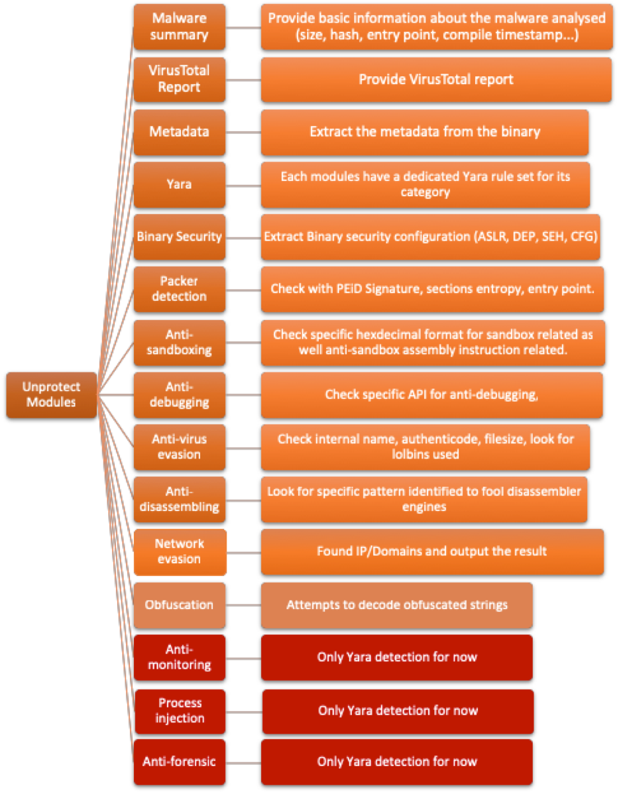

# UNPROTECT [PROJECT]: Unprotect Malware for the Mass
The Unprotect Project is an Open Source project that aims to propose a classification about Evasion Techniques to help to understand and analyze a malware. This project is dedicated to Windows PE malware. It is licensed under APACHE License version 2.0.


The Unprotect Project contains two main parts: 
* A website with a complete database and evasion techniques classification. The website is available here: www.unprotect.it.
* A python standalone tool to detect evasion technique in a specific malware. 

The standalone tool available in this repository contains the following features: 



## Disclaimer
This tool is the result of several months of research and it is an attempt to bring a tool to the community dedicated to malware evasion techniques. It started as a side project and of course requires some improvements. Of course, it is not perfect nor magic! 

Please take notes of the following:
* This project currently works with python2.7 (it will be upgraded to python3 in a later version). 
* It might have some bugs or vulnerabilities.
* This tool is currently working only with a valid PE file (support of additional format file will be added in a later version). 
* There is currently no option supported, the standard output will provide you a full report.
* The analysis can take time depending of the PE size (more than 5 minutes for a PE bigger than 1MB).
* This tool has been tested on Mac OS and Linux, a Windows version can be found in the folder unprotect_windows. 

## Getting Started
### Prerequisites
You must install some packages before to start. 
#### Linux
```bash
apt-get install pip 
apt-get install libfuzzy-dev
apt-get install ssdeep
```
#### Mac OS
```bash
brew install virtualenv
brew install ssdeep
brew install libmagic
```
#### Windows
```bash
pip install virtualenv
```
### Variables To Modify 
Before to run the installation setup, you will need to modify the config.py files to put your own VirusTotal API. 
Put your Virustotal API Key in the [config.py](https://github.com/fr0gger/unprotect/blob/master/module/config.py) file:
```
APIKEY = "<enter_key>"
```
Additionally, the user might want to add his own Yara rules to scan a PE. This can be added in the file [module/yara-rules/user_rules.yar](https://github.com/fr0gger/unprotect/blob/master/module/yara-rules/user_rules.yar).


### Virtualenv
The tool is currently running under [Virtualenv](https://virtualenv.pypa.io/en/latest/), which creates a virtual python work environment to avoid any issue with the current OS as well with the versioning. 

Create your own virtualenv: 
```
virtualenv -p python2.7 unprotect
```
Enable your virtual env: 
```
source unprotect/bin/activate
```

### Package requirements
Install the dependencies: 
```
sudo pip install -r requirements.txt
```
Run unprotect: 
```
python unprotect.py
```
## Usage
The current version of Unprotect doesn’t support any options. The simple way to use unprotect is to run it against a PE file:
```
python unprotect.py <PE_file>
```
## Report Example
Report example can be found here: [Report](https://github.com/fr0gger/unprotect/tree/master/report_example)
## Licence
This project is licensed under the APACHE License version 2.0 - see the [LICENSE.md](LICENSE.md) file for details.
